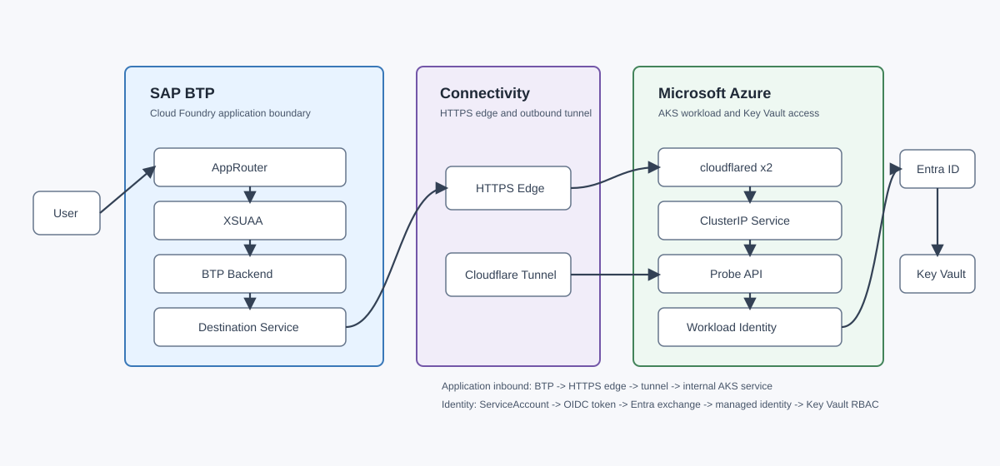
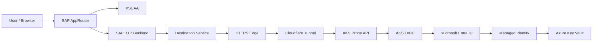
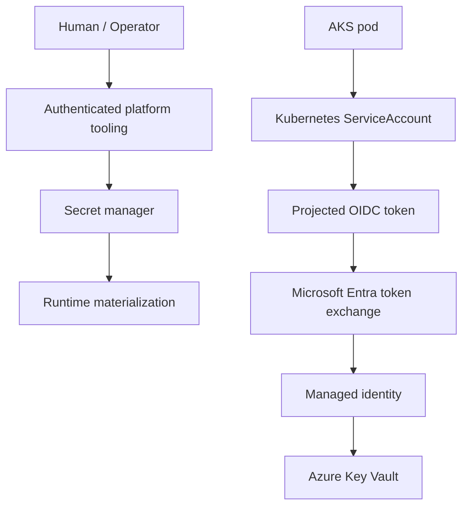
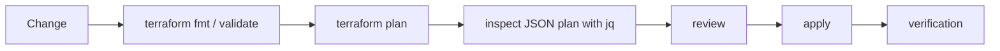

# SAP BTP & Azure Platform Engineering

Cloud Foundry, AKS, Identity, Connectivity & Infrastructure as Code

This project documents a working platform-engineering lab that integrated SAP Business Technology Platform with Microsoft Azure. It focuses on the engineering boundaries that matter in cross-platform systems: identity, connectivity, reproducibility, security, controlled lifecycle operations, and infrastructure-as-code adoption.

The verified implementation connected a SAP BTP Cloud Foundry application to an AKS-hosted probe API through externalized Destination Service configuration and a Cloudflare Tunnel ingress pattern. The AKS workload authenticated to Azure Key Vault with Microsoft Entra Workload Identity, without a static Azure client secret in the pod.

This is a sanitized public portfolio representation of a working lab. No live credentials, account IDs, tenant IDs, environment-specific endpoints, Terraform state, private DNS names or secret material are published.

The repository includes a [sanitized reference implementation](reference-implementation/README.md) with representative SAP BTP Node.js backend code, SAP AppRouter routing, XSUAA authorization model, Terraform configuration and AKS Workload Identity manifests. It is included as code-reading material, not as a turnkey deployable environment.



## Platform Capabilities

| Capability | How it was used | Status |
| --- | --- | --- |
| SAP BTP application runtime | Hosted the Cloud Foundry backend and AppRouter integration layer. | Verified |
| Cloud Foundry | Provided org, space, app, service-instance and route lifecycle for the BTP application. | Verified |
| XSUAA authentication and authorization | Protected the AppRouter/backend flow with a Read scope and Viewer-style role collection. | Verified |
| SAP AppRouter | Served as the authenticated browser entry point and delegated protected calls to the backend. | Verified |
| Destination Service | Externalized the remote HTTPS endpoint instead of hard-coding it in application code. | Verified |
| Connectivity Service | Supported the standalone SAP Cloud Connector on-prem-style connectivity lab. | Verified |
| SAP Cloud Connector | Connected BTP to a local mock/on-prem-style API in a separate verified flow. | Verified |
| Terraform | Managed Azure and BTP resources with explicit provider boundaries and plan-first changes. | Verified |
| Azure AKS | Ran the probe API and cloudflared connector replicas. | Verified |
| Azure Container Registry | Stored the probe API container image used by the AKS workload. | Verified |
| Azure Key Vault | Served as the protected downstream Azure resource for data-plane access verification. | Verified |
| Microsoft Entra Workload Identity | Exchanged projected Kubernetes identity tokens for Azure identity access. | Verified |
| OIDC federation | Linked the AKS ServiceAccount subject to a user-assigned managed identity. | Verified |
| MinIO remote state | Provided S3-compatible Terraform remote state with credentials kept outside Git. | Verified |
| Infisical runtime secrets | Supported runtime materialization of tunnel and operational secrets outside the repository. | Verified |
| Cloudflare Tunnel | Replaced application-level Azure public ingress for the final AKS inbound path. | Verified |
| Correlation-ID tracing | Proved the same request crossed BTP and AKS layers end to end. | Verified |
| Destroy/rebuild lifecycle | Demonstrated disposable Azure lab teardown and recreation from code. | Verified |
| IaC adoption analysis | Documented manual-to-Terraform migration constraints and provider/API behavior. | Verified |

## End-to-End Architecture



The trust transitions are explicit: browser identity is handled by SAP AppRouter and XSUAA; remote endpoint selection is delegated to Destination Service; application inbound connectivity crosses HTTPS and Cloudflare Tunnel; the AKS pod uses a Kubernetes ServiceAccount and OIDC token projection; Microsoft Entra exchanges that token for managed identity access; Azure RBAC authorizes the final Key Vault data-plane operation.

## Verified End-to-End Request

Browser -> AppRouter -> XSUAA -> BTP backend -> Destination -> HTTPS -> secure tunnel -> AKS -> Workload Identity -> Key Vault

The BTP backend propagated a correlation ID to the AKS probe API. The same correlation ID was observed in SAP BTP backend logs and AKS probe API logs, and the AKS response confirmed Key Vault access.

Sanitized representation of the observed result:

```json
{
  "status": "ok",
  "service": "aks-probe-api",
  "correlationId": "demo-correlation-id",
  "keyVaultAccess": true
}
```

## SAP BTP Layer

The SAP BTP side used the conceptual hierarchy of global account, subaccount, Cloud Foundry org and Cloud Foundry space without publishing live account identifiers. AppRouter handled authenticated entry, XSUAA provided scopes and role collections, and the backend consumed Destination Service configuration for the remote AKS-facing endpoint.

Connectivity Service and SAP Cloud Connector were also verified in a standalone BTP connectivity lab where a BTP application reached a local/on-prem-style mock API. Terraform ownership was introduced progressively, including BTP role collection management and destination configuration, while Cloud Foundry-specific concerns remained with the Cloud Foundry provider boundary.

## Azure Platform Layer

The Azure side separated long-lived bootstrap/governance resources from disposable lab infrastructure. The disposable layer included networking, AKS, ACR, Key Vault and workload identity resources. AKS ran the probe API, Cloudflare Tunnel connectors, and the Kubernetes ServiceAccount federated to a Microsoft Entra user-assigned managed identity.

Azure RBAC granted narrowly scoped Key Vault access to the managed identity. The lab was operated through controlled deploy-test-destroy cycles because AKS worker compute was the principal cost driver when the environment was idle.

## Identity And Secrets Model



The AKS workload did not require an Azure application client secret. Cloudflare Tunnel token material, Terraform remote-state credentials, and other runtime secrets were handled outside Git through project-scoped secret management and runtime materialization.

## Connectivity Patterns

| Pattern | Status | Notes |
| --- | --- | --- |
| Direct Azure public LoadBalancer | Verified earlier variant | A public application ingress path was built and tested before the tunnel pattern. |
| Cloudflare Tunnel to AKS ClusterIP | Verified final E2E variant | cloudflared replicas created outbound tunnel connections to expose the internal service path. |
| SAP Cloud Connector to local/on-prem-style API | Verified standalone BTP connectivity lab | BTP used Destination and Connectivity services to reach a local mock/on-prem-style API. |
| SAP Cloud Connector in Azure VNet to private AKS | Planned / not implemented | Future architecture exploration for private Azure service exposure through SAP-native connectivity. |

Cloudflare Tunnel solved application inbound connectivity. It does not remove every Azure networking concern: AKS may still require outbound internet connectivity depending on egress design. SAP Cloud Connector and Cloudflare Tunnel are separate connectivity patterns, not interchangeable replacements.

## Terraform State And Lifecycle

The lab used a durable `bootstrap/` boundary for long-lived governance/platform resources and a disposable `lab/` boundary for AKS, ACR, Key Vault and workload identity resources. Terraform state was separated between SAP and Azure stacks and stored in a MinIO S3-compatible backend with credentials kept outside Git.

Plan-first workflow:



Observed lifecycle proof:

| Operation | Added | Changed | Destroyed |
| --- | ---: | ---: | ---: |
| Destroy | 0 | 0 | 24 |
| Rebuild | 24 | 0 | 0 |

After rebuild, workload identity values were dynamically resolved again, and the Kubernetes ServiceAccount client ID was checked against Terraform output rather than trusting stale hard-coded values.

## Security Engineering Highlights

| Highlight | Engineering value |
| --- | --- |
| No static Azure secret in AKS workload | Reduces long-lived credential exposure. |
| Federated workload identity | Uses short-lived token exchange through Microsoft Entra. |
| Least-privilege Key Vault RBAC | Limits the managed identity to the required data-plane action. |
| Externalized BTP connectivity configuration | Keeps remote endpoint configuration out of application code. |
| No secrets in Git | Prevents public repository exposure of credentials and state. |
| Remote Terraform state | Centralizes state while keeping backend credentials outside the repository. |
| Durable/disposable lifecycle split | Allows lab teardown without destroying bootstrap dependencies. |
| Runtime-only secret material | Materializes sensitive values only where needed at runtime. |
| Correlation-ID E2E verification | Confirms the request crossed the intended platform boundaries. |
| Sanitized public documentation | Preserves architecture value without publishing private identifiers. |

## Engineering Decisions

- [ADR 0001: BTP vs Cloud Foundry Provider Boundary](docs/decisions/0001-btp-vs-cloud-foundry-provider-boundary.md)
- [ADR 0002: Durable Bootstrap vs Disposable Lab](docs/decisions/0002-bootstrap-and-disposable-lab.md)
- [ADR 0003: Federated Workload Identity Over Static Secrets](docs/decisions/0003-workload-identity-over-static-secrets.md)
- [ADR 0004: Destination Service for Externalized Connectivity](docs/decisions/0004-destination-service-for-externalized-connectivity.md)
- [ADR 0005: MinIO Remote Terraform State](docs/decisions/0005-minio-remote-terraform-state.md)
- [ADR 0006: Infrastructure vs Workload Lifecycle](docs/decisions/0006-infrastructure-vs-workload-lifecycle.md)
- [ADR 0007: Cloudflare Tunnel Connectivity](docs/decisions/0007-cloudflare-tunnel-connectivity.md)
- [ADR 0008: SAP Cloud Connector Pattern](docs/decisions/0008-sap-cloud-connector-pattern.md)
- [ADR 0009: Plan-First Destroy/Rebuild](docs/decisions/0009-plan-first-destroy-rebuild.md)

## Reference Implementation

The [reference implementation](reference-implementation/README.md) contains sanitized code that mirrors the verified implementation shape:

| Area | Files |
| --- | --- |
| SAP BTP backend | [server.js](reference-implementation/sap-btp/application/server.js), package metadata and XSUAA/Destination handling. |
| SAP AppRouter | [xs-app.json](reference-implementation/sap-btp/approuter/xs-app.json) and AppRouter package metadata. |
| SAP Terraform | Cloud Foundry apps, routes, service instances, bindings, destinations, role collection assignment and [xs-security.json](reference-implementation/sap-btp/terraform/xs-security.json). |
| Azure Terraform | AKS, ACR, Key Vault, managed identity, federated identity credential and RBAC reference configuration. |
| Azure probe API | [main.go](reference-implementation/azure/probe-api/main.go), Go module metadata and Dockerfile. |
| Kubernetes | Namespace, ServiceAccount, probe API and cloudflared deployment manifests. |

The older manual `cf push` manifest style is documented only as evolution history because the final implementation used stable Terraform-managed routes and Destination Service.

## Implementation Status

| Status | Meaning |
| --- | --- |
| ✅ Verified | Implemented and observed in the lab. |
| 🟡 Partial | Implemented to a meaningful degree but intentionally not presented as complete production automation. |
| 🔵 Planned | Architecture exploration or future work; not implemented in the verified lab. |

See [implementation status](docs/evidence/implementation-status.md) for the detailed matrix.

## Terraform Adoption And Provider Analysis

The lab included migration from manual resources into Terraform ownership. The repository documents the important adoption cases instead of hiding them:

- [Terraform adoption](docs/engineering/terraform-adoption.md)
- [Provider limitations](docs/engineering/provider-limitations.md)
- [Migration failure analysis](docs/engineering/migration-failure-analysis.md)
- [Lifecycle workarounds](docs/engineering/lifecycle-workarounds.md)
- [Upstream opportunities](docs/engineering/upstream-opportunities.md)
- [Version context](docs/engineering/version-context.md)

Key distinction: XSUAA parameter read-back limitations are documented as broker/API behavior, while Cloud Foundry app/binding replacement behavior is treated as a candidate for minimal upstream reproduction.

## Version Context

The historical lab implementation used Terraform `>= 1.15.0`, `cloudfoundry/cloudfoundry` `1.17.0`, `SAP/btp` `1.25.0`, and `hashicorp/azurerm` `5.2.0`. Public examples preserve those historical provider versions where schema accuracy matters. If a future reproducer is validated against newer provider releases, the documentation should distinguish "originally implemented with" from "currently validated with".

## Technology Stack

SAP BTP, Cloud Foundry, XSUAA, SAP AppRouter, Destination Service, Connectivity Service, SAP Cloud Connector, Microsoft Azure, AKS, ACR, Azure Key Vault, Microsoft Entra ID, Terraform, Kubernetes, Go, Docker, MinIO, Infisical, Cloudflare Tunnel, Bash, jq, GitHub Actions.

## What This Project Demonstrates

This repository demonstrates cross-cloud platform integration, infrastructure as code, identity federation, Kubernetes operations, IAM/RBAC reasoning, secret management, connectivity trade-offs, troubleshooting, lifecycle design, Terraform plan inspection, correlation-based observability, operational rebuild, and architecture documentation.

## Documentation Map

- Reference implementation: [overview](reference-implementation/README.md), [SAP BTP](reference-implementation/sap-btp/README.md), [Azure](reference-implementation/azure/README.md)
- Architecture: [overview](docs/architecture/platform-overview.md), [end-to-end flow](docs/architecture/end-to-end-flow.md), [identity and secrets](docs/architecture/identity-and-secrets.md), [connectivity patterns](docs/architecture/connectivity-patterns.md), [Terraform state](docs/architecture/terraform-state.md)
- Platform: [SAP BTP foundation](docs/platform/sap-btp-foundation.md), [Azure AKS foundation](docs/platform/azure-aks-foundation.md), [workload identity](docs/platform/workload-identity.md), [application flow](docs/platform/application-flow.md)
- Evidence: [implementation status](docs/evidence/implementation-status.md), [end-to-end verification](docs/evidence/end-to-end-verification.md), [lifecycle verification](docs/evidence/lifecycle-verification.md)
- Engineering: [Terraform adoption](docs/engineering/terraform-adoption.md), [provider limitations](docs/engineering/provider-limitations.md), [migration failure analysis](docs/engineering/migration-failure-analysis.md), [lifecycle workarounds](docs/engineering/lifecycle-workarounds.md), [upstream opportunities](docs/engineering/upstream-opportunities.md), [version context](docs/engineering/version-context.md)
- Evolution: [manual CF push](docs/evolution/01-manual-cf-push.md), [Destination Service](docs/evolution/02-destination-service.md), [Terraform adoption](docs/evolution/03-terraform-adoption.md), [stable routing](docs/evolution/04-stable-routing.md)
- Operations: [destroy/rebuild](docs/operations/destroy-rebuild.md), [verification runbook](docs/operations/verification-runbook.md), [architecture walkthrough](docs/operations/interview-demo.md)
- Security: [security model](docs/security/security-model.md), [public repository sanitization](docs/security/public-repository-sanitization.md)
- Examples: [representative sanitized patterns](examples/README.md)

## Future Work

Future work is explicitly separate from the verified implementation: private AKS access using SAP Cloud Connector in an Azure VNet, reverse AKS -> BTP integration, Kustomize migration, Ansible-managed Cloud Connector host, Gateway API / NGINX Gateway Fabric exploration, and deeper CI/CD automation.

## Official References

- [SAP BTP Connectivity](https://help.sap.com/docs/connectivity/sap-btp-connectivity-cf/destinations)
- [SAP Destination Service consumption](https://help.sap.com/docs/connectivity/sap-btp-connectivity-cf/consuming-destination-service)
- [Microsoft Learn: AKS Workload Identity](https://learn.microsoft.com/azure/aks/workload-identity-overview)
- [Microsoft Learn: Key Vault RBAC](https://learn.microsoft.com/azure/key-vault/general/rbac-guide)
- [Kubernetes ServiceAccounts](https://kubernetes.io/docs/concepts/security/service-accounts/)
- [Cloudflare Tunnel on Kubernetes](https://developers.cloudflare.com/tunnel/deployment-guides/kubernetes/)
- [Terraform Registry: azurerm_federated_identity_credential](https://registry.terraform.io/providers/hashicorp/azurerm/latest/docs/resources/federated_identity_credential)
