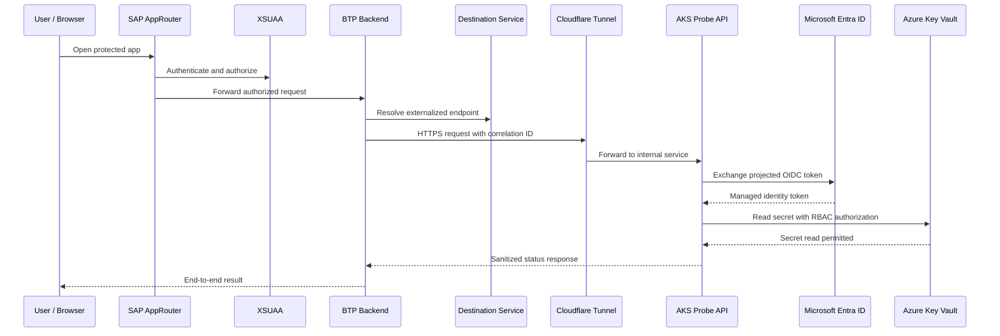

# End-to-End Flow

The central verified request flow connected SAP BTP to an Azure-hosted AKS workload and then to Azure Key Vault through workload identity federation.



## Verification Signal

The same correlation ID was observed at the SAP BTP backend and at the AKS probe API. The AKS response also returned `keyVaultAccess = true`, which confirmed that the flow did not stop at an intermediary gateway or tunnel layer.

Sanitized representation:

```json
{
  "status": "ok",
  "service": "aks-probe-api",
  "correlationId": "demo-correlation-id",
  "keyVaultAccess": true
}
```

## Important Nuance

Cloudflare Tunnel was used for application inbound connectivity to AKS. It should not be described as removing all Azure public networking needs. The AKS cluster can still require outbound internet access for image pulls, control-plane interactions, package retrieval, logging, or other egress-dependent operations depending on the deployed configuration.
