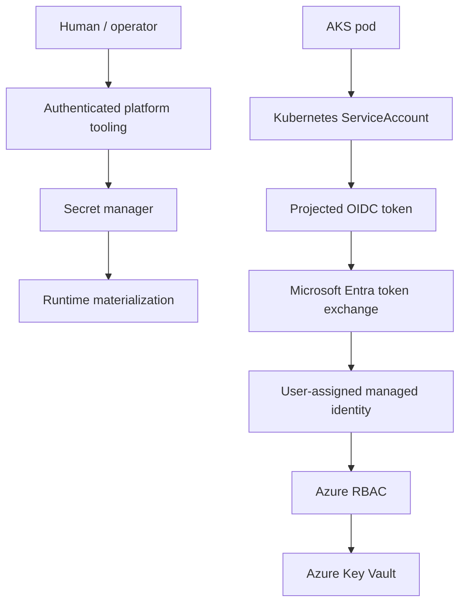

# Identity And Secrets

The lab separated human/operator authentication from workload-to-Azure authentication.

## Workload Identity

The AKS probe API used Kubernetes ServiceAccount identity and AKS OIDC issuer support. Microsoft Entra workload identity federation mapped the ServiceAccount subject to a user-assigned managed identity. That managed identity received narrowly scoped Key Vault access through Azure RBAC.

No Azure application client secret was required inside the AKS workload.

## Secret Handling

Cloudflare Tunnel token material, Terraform remote-state credentials, platform credentials and runtime-only values were handled outside Git. The repository contains only placeholders and representative examples.

## Authentication vs Authorization

Authentication established who the user or workload was. Authorization decided what the authenticated identity could do. In this lab, XSUAA roles authorized the SAP BTP application path, while Azure RBAC authorized Key Vault access for the managed identity.

## References

- [Microsoft Learn: AKS Workload Identity](https://learn.microsoft.com/azure/aks/workload-identity-overview)
- [Microsoft Learn: Key Vault RBAC](https://learn.microsoft.com/azure/key-vault/general/rbac-guide)
- [Kubernetes ServiceAccounts](https://kubernetes.io/docs/concepts/security/service-accounts/)
